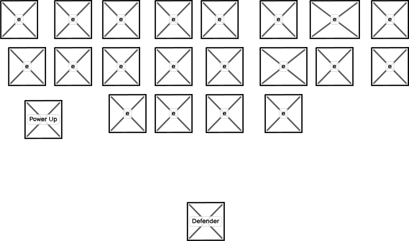
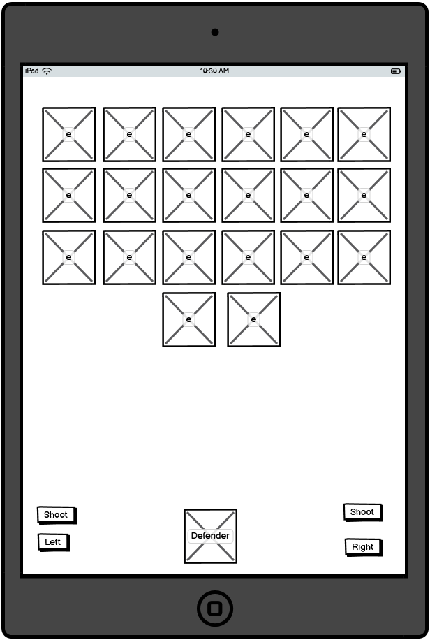

# [Table of contents](#top) 
-1. [Shooter Overview](#1-shooter-overview) 

-2. [Existing Features](#2-existing-features) 
- [Favicon](#favicon) 
- [The Landing Page](#landing-page) 
- [The Game Playing Area](#the-game-playing-area) 
- [The Game Over Page](#game-over-page") 
- [The 404 Error Page](#404-error-page) 
- [Features left to implement](#features-left-to-implement) 
	

-3. [Wireframes](#3-wireframes)
 - [Wireframe Landing Page](#index-landing-page) 
 - [Main Game playing area](#wireframe-main-game-playing-area) 
- [Game over page](#wireframe-game-over-page) 
- [404 Page](#wireframe-404-page) 

-4. [Technologies](#4-technologies) 
- HTML 
- CSS 
- JavaScript 
- Git 
- GitHub 
- Balsamiq 
- Apache2 sandbox 
- Favicon.io 
- CraftPix 
- VSCodium on Ubuntu Linux 

-5. [Testing](#testing) 
   - [Accessibility](#accessibility) 
   - [Lighthouse testing](#lighthouse-testing) 
    - [Desktop](#desktop) 
    - [Mobile](#mobile) 
   - [Functional tests](#functional-tests) 
   - [Validation of code](#validation-of-code) 
    - [CSS](#css) 
    - [HTML](#html) 
    - [JavaScript](#javascript) 

-6. [Deployment](#6-deployment) 
-7. [Credits](#7-credits) 

    <a href="#top" >Goto Top</a>

## 1. Shooter Overview

This project is about a simple 2D shooter game written in JavaScript with HTML and CSS. Link to online website: https://michaelcloran.github.io/shooter/index.html

    <a href="#top" >Goto Top</a>

## 2. Existing Features
- Favicon 
The favicon is a fun icon to show in the browser tabs to quickly identify the Shooter webpage. 
 

- The Landing Page 
 

- The Game Playing Area Notice the two buttons play sound and pause sound. These buttons are used to play and stall background music. 
 

- The Game Over Page 
 

- The 404 Error Page 
 

- Features left to implement 
The game works well but I have not implemented powerups which would be like boxes which could be shot with current code and if shot it adds to credits of the player.
The game when used on a mobile if you do a touch screen select and move gesture then the controls get a little confused. I am currently unsure how to fix this gesture. If the buttons are clicked the ship can move left and right and shoot. I have chosen to have the player continually scroll left or right as with buttons it hard to continually click the button and move!!.

    <a href="#top" >Goto Top</a>

## 3. Wireframes

### Index Landing page

 
Above shows the landing page for a Desktop.

 
Above shows a landing page for a mobile device.

    <a href="#top" >Goto Top</a>

### Wireframe Main Game Playing Area

 

Above shows game for Desktop.

 

Above shows the game for a mobile device.

    <a href="#top" >Goto Top</a>

### Wireframe game over page

 

Above shows the Game Over page for a Desktop.

 

Above shows the game over screen for a mobile device.

    <a href="#top" >Goto Top</a>

### Wireframe 404 page 

 

Above shows the 404 not found screen for mobile and Desktop. It redirects to the landing page after 10 seconds.

    <a href="#top" >Goto Top</a>

## 4. Technologies
- HTML 
HTML was the markup used for the site.
- CSS 
CSS was used to do some basic styling.
- JavaScript 
- Git 
Git was used.
- GitHub 
The repo is held on GitHub.
- Balsamiq 
The wireframes were done by Balsamiq.
- Apache2 sandbox 
I used a sandbox which was Apache 2.
- Favicon.io 
I got the fun browser icon from https://favicon.io/favicon-generator/
- CraftPix  
I went to website craftpix.net and done a search for space and found a free image pack. Then I unzipped it into my Code Institute folder for PP2 and found 4 folders with images within each.1. PSD for fighter , bomber and corvette spritelist. 2. Fighter with a individual sprite list per state for eg Damage, destroyed, turn_2, turn_1, Attack_2, Attack_1, Boost, Move, Idle, Charge 1 and 2. The other 2 folders are for Bomber and Corvette space ships. The game pack came with a lot of images. I am going to go for minimum viable project MVP first and then add based on time!!.
- VSCodium on Ubuntu Linux 

    <a href="#top" >Goto Top</a>

## 5. Testing 
- Accessibility 
- Lighthouse testing 
- Desktop 
- Mobile 
- Functional tests 
- Validation of code 
- CSS 
- HTML 
- JavaScript 

    <a href="#top" >Goto Top</a>

## 6. Deployment

For Deployment I setup the project/repo folder shooter on GitHub with template 
from Code Institute 

opened terminal went to document Root of the Apache 2 webserver sandbox 
git clone  https://github.com/michaelcloran/shooter 
Cloning into 'shooter'... etc 
cd shooter 
in another terminal window 
cd /home/michael/.ssh 
ssh-keygen -t ed25519 -C "michaelcloran2010@gmail.com" 
asked for passphrase entered it 
more id_ed25519_shooter.pub 
from screen dump copied over into 
on GitHub went to settings deploy keys 
in text area copied over key with title shooter 
went back to terminal /home/michael/.ssh/ ran more config 
 
edited config added 
#shooter account pp2 code institute 
Host github.com-shooter 
HostName github.com 
ForwardAgent yes 
User git 
IdentityFile ~/.ssh/id_ed25519_shooter 
IdentitiesOnly yes 
from documentroot of web server and then cd into cloned shooter directory ran 
git remote set-url  origin git+ssh://git@github.com-shooter:/michaelcloran/shooter.git 
then ran 
ssh-add ~/.ssh/id_ed25519_shooter 
had to give passphrase but this should be the only time till i logout and then I have  
todo ssh-add ~/.ssh/id_ed25519_shooter again 
 
then edited Read.md 
git add . 
git commit -m "docs initial commit" 
git push 
Things are now setup for development 

### To deploy a live website

I went to GitHub logged in choose repo Shooter and clicked on settings
and then pages. I then clicked on source delpoy from branch and branch
from dropdown choose main and root and clicked on save.

    <a href="#top" >Goto Top</a>

## 7. Credits
- W3schools.com: https://www.w3schools.com/graphics/game_intro.asp  
I used this tutorial to build the game engine from scratch.
- Balsamiq 
I used Balsamiq to do mockup wireframes.

- resize of images with canvas context
https://stackoverflow.com/questions/19262141/resize-image-with-javascript-canvas-smoothly  
I used the above to give me ideas on how to resize the images for mobile and small screen usage.

- Awesome laser sound: https://pixabay.com/sound-effects/search/laser/
- sound track background: https://cdn.pixabay.com/
- YouTube Space Invaders tutorial: https://www.youtube.com/watch?v=MCVU0w73uKI
- Book used as reference: 2D Game Collision Detection, An introduction to clashing geometry in games by Thomas Schwarzl.

    <a href="#top" >Goto Top</a>

