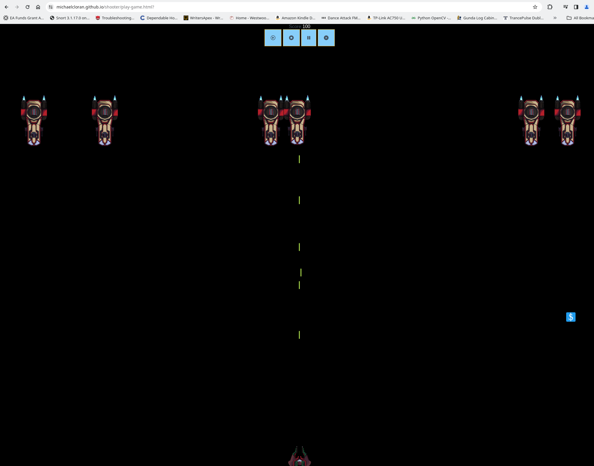
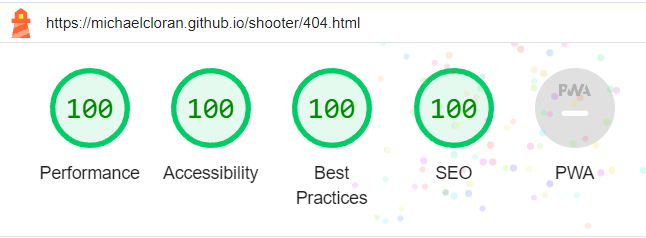
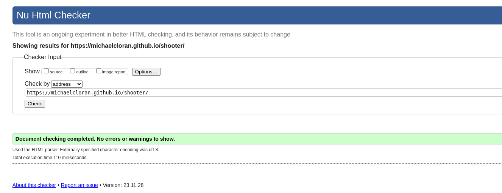
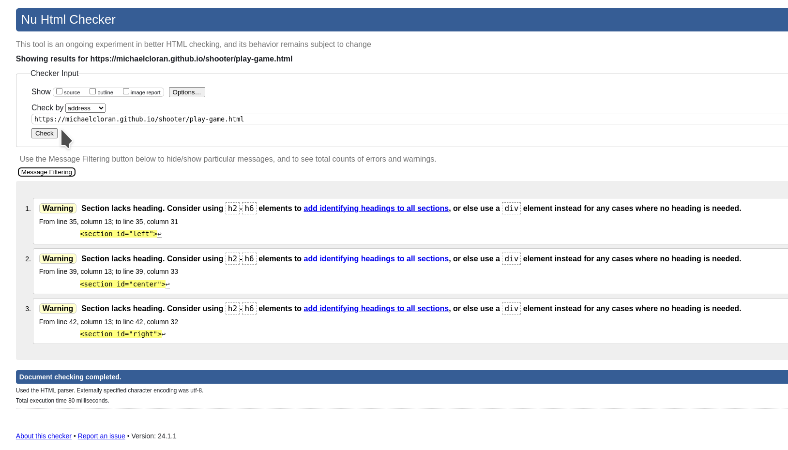
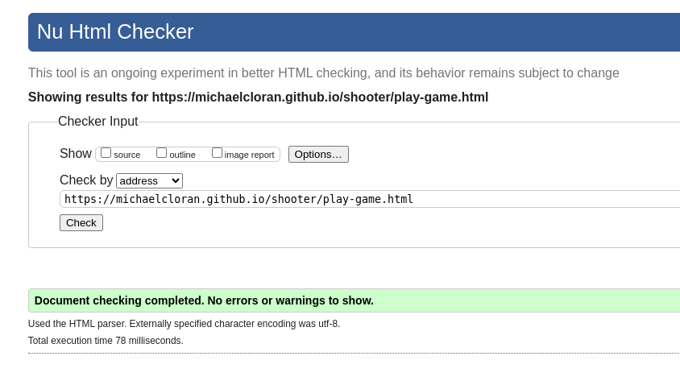

# [Table of contents](#top) 
-1. [Shooter Overview](#1-shooter-overview) 

-2. [Existing Features](#2-existing-features) 
- Favicon 
- The Landing Page 
- The Game Playing Area 
- The Game Over Page 
- The 404 Error Page 
- Features left to implement 
	

-3. [Wireframes](#3-wireframes)
 - [Wireframe Landing Page](#index-landing-page) 
 - [Main Game playing area](#wireframe-main-game-playing-area) 
- [Game over page](#wireframe-game-over-page) 
- [404 Page](#wireframe-404-page) 

-4. [Technologies](#4-technologies) 
- HTML 
- CSS 
- JavaScript 
- Git 
- GitHub 
- Balsamiq 
- Apache2 sandbox 
- Favicon.io 
- CraftPix 
- VSCodium on Ubuntu Linux 

-5. [Testing](#5-testing) 
- Tests Done 
- Functional tests 
- Accessibility 
- Lighthouse testing 
- Validation of code 
- CSS 
- HTML 
- JavaScript 

-6. [Deployment](#6-deployment) 
-7. [Credits](#7-credits) 

    <a href="#top" >Goto Top</a>

## 1. Shooter Overview

 

This project is about a simple 2D shooter game written in JavaScript with HTML and CSS. Link to online website: https://michaelcloran.github.io/shooter/index.html

    <a href="#top" >Goto Top</a>

## 2. Existing Features
- ### Favicon 
The favicon is a fun icon to show in the browser tabs to quickly identify the Shooter webpage. 
 

- ### The Landing Page 
 

If you click on the Play Game button the game begins to play 
 

- ### The Game Playing Area 
 

Notice the four buttons play sound effects or to stop sound effects, the pause button is used to pause the game and the x button is used to exit the game Also notice the score which is positioned above this four button div. This game uses Cookies where the cookie stores the soundOn boolean and the highestScore variable. If on the credits page you achieve a credit more than the cookie highestScore then you are congradulated and a new personal highScore is stored into the Cookie. The game starts off with 6 enemies on the screen and if you kill some, then in the game loop a respawn of 5 - numberOfEnemies is respawned . Also powerups work which is done via a dollar sign box which is put on a random position on the screen and it moves down at a certain speed and if it goes over the screen space available it is garbage collected and a respawn is done. If the box is shot the player gets bonus points credited to their score. A cool effect which should be dealt with is the states of the enemies. State 0 for normal movement where 3 images are cycled through to show the jets. State 1 for discharging weapons where 4 images are cycled through and last but not least where in state 2 where the enemy is dieing 10 images cycled through to show an explosion!! Awesome!! 
It should be also said if you are playing this game on a mobile buttons appear left and right of the canvas to move left and right and to shoot. Also on a mobile the images are scaled in order to be able to make the game playable on a mobile. 

screen shot taken from desktop. 
 

On a desktop to move the player the left and right arrow keys are used and to shoot use the spacebar. 

The enemy has to be shot. The enemy takes 2 shots to be killed
 

The player is just a spaceship shown at the bottom of the screen and it takes 1 shot to be killed or a collision with an enemy spaceship!.
 

For mobile devices the left right and shoot buttons are used for controls.

screen shot taken from mobile portrait 
 

screen shot taken from mobile landscape 
 

- ### The Game Over Page 

On the Game Over page if your score is higher than the highest score held in a Cookie then you are congratulated and if not your score is just displayed. If you have the highest score then the Cookie is updated for next personal best!!.Also from this screen it is possible to play the game again by clicking on the Play again button.

 

- The 404 Error Page 
 

- ### Features left to implement 
The game works well. The game when used on a mobile if you do a touch screen select and move gesture then the controls get a little confused. I am currently unsure how to fix this gesture. If the buttons are clicked the ship can move left and right and shoot. I have chosen to have the player continually scroll left or right as with buttons it hard to continually click the button and move!!. Note that on a desktop I notice some flicker. This would be fixed by double buffering. Another thing that should be added is GamePad functionality. This would truely make the game more playable and then I could on the mobile get the user interface to work similar to a desktop!!.

    <a href="#top" >Goto Top</a>

## 3. Wireframes

### Index Landing page

 
Above shows the landing page for a Desktop.

 
Above shows a landing page for a mobile device.

    <a href="#top" >Goto Top</a>

### Wireframe Main Game Playing Area

 

Above shows game for Desktop.

 

Above shows the game for a mobile device.

    <a href="#top" >Goto Top</a>

### Wireframe game over page

 

Above shows the Game Over page for a Desktop.

 

Above shows the game over screen for a mobile device.

    <a href="#top" >Goto Top</a>

### Wireframe 404 page 

 

Above shows the 404 not found screen for mobile and Desktop. It redirects to the landing page after 10 seconds. This has since been changed. The 404 page no longer has the redirect the user has to manually click on a link to get back to the landing page.

    <a href="#top" >Goto Top</a>

## 4. Technologies
- HTML 
HTML was the markup used for the site.
- CSS 
CSS was used to do some basic styling.
- JavaScript 
The Game Engine was written in JavaScript.
- Git 
Git was used.
- GitHub 
The repo is held on GitHub.
- Balsamiq 
The wireframes were done by Balsamiq.
- Apache2 sandbox 
I used a sandbox which was Apache 2.
- Favicon.io 
I got the fun browser icon from https://favicon.io/favicon-generator/
- CraftPix  
I went to website craftpix.net and done a search for space and found a free image pack. Then I unzipped it into my Code Institute folder for PP2 and found 4 folders with images within each.1. PSD for fighter , bomber and corvette spritelist. 2. Fighter with a individual sprite list per state for eg Damage, destroyed, turn_2, turn_1, Attack_2, Attack_1, Boost, Move, Idle, Charge 1 and 2. The other 2 folders are for Bomber and Corvette space ships. The game pack came with a lot of images. I am going to go for minimum viable project MVP first and then add based on time!!.
- VSCodium on Ubuntu Linux 

    <a href="#top" >Goto Top</a>

## 5. Testing
- ### Tests Done.
<table>
<fieldset>Sprite sequences</fieldset>
    <tr>
        <th>state</th>
        <th></th>
        <th></th>
        <th></th>
        <th></th>
        <th></th>
        <th></th>
        <th></th>
        <th></th>
        <th></th>
    </tr>
    <tr>
        <td>Move</td>
        <td> </td>
        <td></td>
        <td></td>
    </tr>
     <tr>
        <td>Shoot</td>
        <td> </td>
        <td></td>
        <td></td>
        <td></td>
    </tr>
    <tr>
        <td>Explode</td>
        <td> </td>
        <td></td>
        <td></td>
        <td></td>
        <td> </td>
        <td></td>
        <td></td>
        <td></td>
        <td></td>
        <td></td>
    </tr>
</table>

On Desktop, tablet and mobile it was verified that the sprite sequencing worked well. When a shoot state or explode state is initiated if sound is enabled then a shoot or explosion sound is played. This gives the user a better experience. It was also verified on mobile and desktop that the collision detection system worked. If the player collides with an enemy ship then a collision is detected and the game is over as the player has only one life. Also if the player shoots a projectile it is emitted from the center of the player position and it propagates upwards if it reaches the top of the screen and goes off the screen then its removed through garbage collection. If the shot collides with an emeny then its garbage collected and the enemy health is decremented. If the enemy has no health left it goes into the dieing/explosion state and the sprite sequence for explosion is cycled through and the enemy is removed from the game. A respawn is done if the number of enemies is below 5. The respawn algorithm adds the number of enemies to the screen at y = 0 and x is set to a random number to position the enemy on the visible screen.

The collision detection system is just a simple 2D bounding box collision detection algortithm. If one box overlaps another box then a collision is detected and the system does the appropiate algorithm for the collision.(play sound and go into dieing sequence etc)

### Responsiveness
All pages were tested to ensure responsiveness on screen sizes from 280px and upwards as defined in WCAG 2.1 Reflow criteria for responsive design on Chrome, Edge, Firefox and Opera browsers.

Steps to test:

Open browser and navigate to Shooter
Open the developer tools (right click and inspect)
Set to responsive and decrease width to 280px by selecting Galaxy Fold
Click and drag the responsive window to maximum width
Expected:

Website is responsive on all screen sizes and no images are pixelated or stretched. No elements overlap.

An example of a bug 
It should be noted that on FireFox especially that the explosion sequence does not always play. I am unsure what the problem is as it works normally. I had a closer look at the algorithm for displaying images on state and image counter and noticed that I was loading into an image object every 20ms for each enemy on the screen. This was bad!!.

Symptons when the enemy ship goes into the dieing state it just kinda hangs/stalls for a while and then removes the enemy ship. It may or may not display 1 or more images from the explosion sprite sheet.

My fix In words was to load the enemy image objects and store the image objects into a 2 dimensional array and load that at the top of the JavaScript file. So by loading the objects at the start and only once then when used you will only need to index the correct state and image for the drawImage function. This is much better!!.

- ### Functional tests 
It should be noted about mobile portrait or landscape usage. When on the landing page you should decide which orientation to play the game in and switch to it on the landing page as if you switch orientation during the game, it upsets the user interface!!. 
The following table outlines functional testing for this project. I used Google Chrome for most testing but I have also used Microsoft Edge, Firefox, Opera and an actual mobile phone and got reasonable results.

<table>
    <tr>
        <th>device</th>
        <th>portrait</th>
        <th>landscape</th>
    </tr>
    <tr>
        <td>desktop</td>
        <td>Good expenience</td>
        <td>n/a</td>
    </tr>
    <tr>
        <td>iPhone SE</td>
        <td>Good</td>
        <td>Good</td>
    </tr>
    <tr>
        <td>iPhone XR</td>
        <td>Good</td>
        <td>Good</td>
    </tr>
    <tr>
        <td>iPhone 12 Pro</td>
        <td>Good</td>
        <td>Good</td>
    </tr>
    <tr>
        <td>iPhone 14 Pro Max</td>
        <td>Good</td>
        <td>Good</td>
    </tr>
    <tr>
        <td>Pixel 7</td>
        <td>Good</td>
        <td>Good</td>
    </tr>
    <tr>
        <td>Samsung Galaxy S8+</td>
        <td>Good</td>
        <td>Good</td>
    </tr>
    <tr>
        <td>Samsung Galaxy S20 Ultra</td>
        <td>Good</td>
        <td>Good</td>
    </tr>
    <tr>
        <td>iPad Mini</td>
        <td>Good</td>
        <td>Good</td>
    </tr>
    <tr>
        <td>iPad Air</td>
        <td>Good</td>
        <td>Good</td>
    </tr>
    <tr>
        <td>iPad Pro</td>
        <td>Good</td>
        <td>Good</td>
    </tr>
    <tr>
        <td>Surface Pro 7</td>
        <td>Good</td>
        <td>Good</td>
    </tr>
    <tr>
        <td>Surface Duo</td>
        <td>Good</td>
        <td>Good</td>
    </tr>
    <tr>
        <td>Galaxy Fold</td>
        <td>Good</td>
        <td>Good but limited space</td>
    </tr>
    <tr>
        <td>Samsung Galaxy A51/71</td>
        <td>Good</td>
        <td>Good</td>
    </tr>
    <tr>
        <td>Nest Hub</td>
        <td>Good</td>
        <td>n/a</td>
    </tr>
    <tr>
        <td>Nest Hub Max</td>
        <td>Good</td>
        <td>n/a</td>
    </tr>
    <tr>
        <td>Huawei P20 Lite (actual Mobile Phone)</td>
        <td>Space is limited, controls are hard</td>
        <td>Space is limited, controls are hard</td>
    </tr>
</table>

For mobile phone usage an ability to add a GamePad would make the game awesome. But I dont currently have a GamePad for testing with so this avenue was not explored!!.

- ### Accessibility 
Wave acessibility was used in this project :https://wave.webaim.org/. This tool was used throughout development and for final testing of the deployed website to check for any aid accessibility testing.

- Testing was focused to ensure the following criteria were met:

- All forms have associated labels or aria-labels so that this is read out on a screen reader to users who tab to form inputs
- Color contrasts meet a minimum ratio as specified in WCAG 2.1 Contrast Guidelines
- Heading levels are not missed or skipped to ensure the importance of content is relayed correctly to the end user
- All content is contained within landmarks to ensure ease of use for assistive technology, allowing the user to navigate by page regions
- All not textual content had alternative text or titles so descriptions are read out to screen readers
- HTML page lang attribute has been set
- Aria properties have been implemented correctly
- WCAG 2.1 Coding best practices being followed

- ### Lighthouse testing 
the Index.html, play-game.html,end_game_page.html and 404.html were simulated in incognito mode on a desktop and the following results were found. 
 

 

 

 

- ## Validation of code 

- ### CSS 
I went to https://jigsaw.w3.org/css-validator/ and put in the url of my site and got the following results 
 
- ### HTML 
I went to https://validator.w3.org/ to validate the HTML of the landing page. 
 

 

For above screenshot I replaced the sections with divs and got below screenshot 

 

 

 

- ### JavaScript 
I went to https://jshint.com/ and copied over my script.js and found various issues mostly todo with missing semicolons and when this was fixed, some variables had to be used in the this.variable context. I use 2 scripts for my project in the play-game.html i define some scripting inside script tags and define global variable in the first and these are used in the second. So jshint points this out as undefined variables.

    <a href="#top" >Goto Top</a>

## 6. Deployment

For Deployment I setup the project/repo folder shooter on GitHub with template 
from Code Institute 

opened terminal went to document Root of the Apache 2 webserver sandbox 
git clone  https://github.com/michaelcloran/shooter 
Cloning into 'shooter'... etc 
cd shooter 
in another terminal window 
cd /home/michael/.ssh 
ssh-keygen -t ed25519 -C "michaelcloran2010@gmail.com" 
asked for passphrase entered it 
more id_ed25519_shooter.pub 
from screen dump copied over into 
on GitHub went to settings deploy keys 
in text area copied over key with title shooter 
went back to terminal /home/michael/.ssh/ ran more config 
 
edited config added 
#shooter account pp2 code institute 
Host github.com-shooter 
HostName github.com 
ForwardAgent yes 
User git 
IdentityFile ~/.ssh/id_ed25519_shooter 
IdentitiesOnly yes 
from documentroot of web server and then cd into cloned shooter directory ran 
git remote set-url  origin git+ssh://git@github.com-shooter:/michaelcloran/shooter.git 
then ran 
ssh-add ~/.ssh/id_ed25519_shooter 
had to give passphrase but this should be the only time till i logout and then I have  
todo ssh-add ~/.ssh/id_ed25519_shooter again 
 
then edited Read.md 
git add . 
git commit -m "docs initial commit" 
git push 
Things are now setup for development 

### To deploy a live website

I went to GitHub logged in choose repo Shooter and clicked on settings
and then pages. I then clicked on source delpoy from branch and branch
from dropdown choose main and root and clicked on save.

    <a href="#top" >Goto Top</a>

## 7. Credits
- W3schools.com: https://www.w3schools.com/graphics/game_intro.asp  
I used this tutorial to build the game engine from scratch. Boilerplate code was taken from it!!.
- Balsamiq 
I used Balsamiq to do mockup wireframes.

- resize of images with canvas context
https://stackoverflow.com/questions/19262141/resize-image-with-javascript-canvas-smoothly  
I used the above to give me ideas on how to resize the images for mobile and small screen usage.

- Awesome laser sound: https://pixabay.com/sound-effects/search/laser/
- sound track background: https://cdn.pixabay.com/
- YouTube Space Invaders tutorial: https://www.youtube.com/watch?v=MCVU0w73uKI
- Book used as reference: 2D Game Collision Detection, An introduction to clashing geometry in games by Thomas Schwarzl.
- Book used as reference: Game Programming All In One Third Edition by Jonathan S. Harbour.
- I'd like to credit my mentor for some good advice Gareth McGirr.

    <a href="#top" >Goto Top</a>

